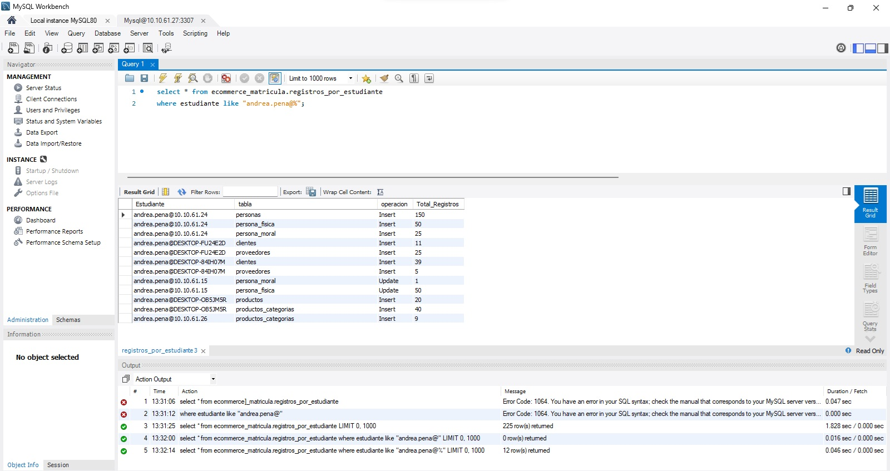

## Test 01: Consultar los registros por Estudiantes
--- 

#### Descripción:
Consulta SQL a la base de datos centralizado del proyecto de clase de
 e-commerce para la materia de Bases de Datos para Negocios 
Digitales.

#### Objetivo:
Verificar que el estudiante:
- Comprende la estructura de la base de datos.
- Es capaz de realizar una consulta SELECT correctamente .
- Aplica filtros (*where*) a la vista de **Registros por Estudiante**

#### Criterios de Validación:
- Muestra los registros que ha realizado a la base de datos.
- Deberá contar con 75 registros de personas.
- Deberá contar con 50 registros de personas físicas.
- Deberá contar con 20 registros de personas morales.
- Deberá contar con 20 registros en productos.
- Deberá contar con al menos 40 registros de categorización de 
productos (por aquello que les toco una subcategoría).
- Deberá contar con 20 registros de categorización en base al origen del producto
(Nacional/Importación).

#### Evidencia 

#### Estatus:
Exitosa.
