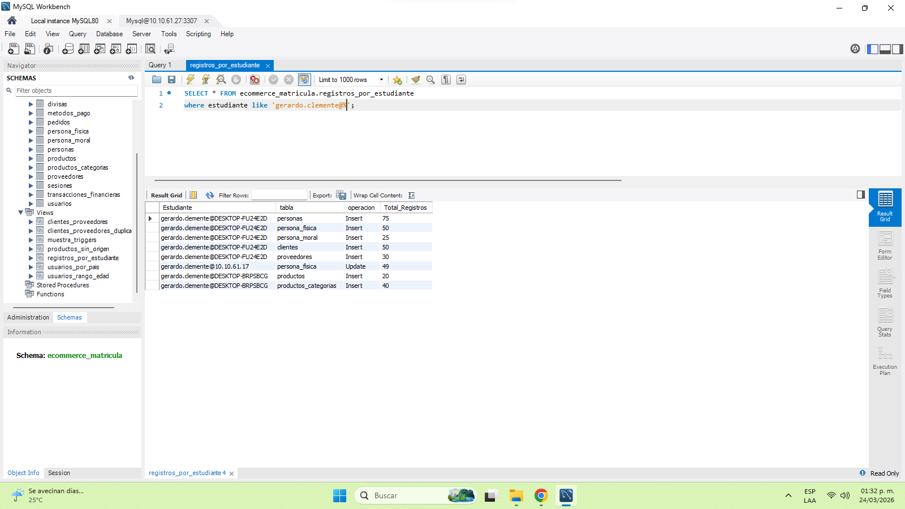

## Test 01 consultar los registro por estudiantes 
---

#### Descripción: 
Consulta SQL a la base d datos centralizada del proyecto de clase de e-commerce para la materia de base de datos para negocios digitales 

#### Objetivo:
verificar que el estudiante;
•comprende la estructura de la base de datos
•es capas de realizar una consulta select correctamente 
•aplicar fistras (*where*) a la vista de **registro por estudiante**

### criterios de evaluación

•muestra los registro que ha realizado a la base de datos 
•deberá contar con 75 registro de personas 
•deberá contar con 50 registros en persona física 
•deberá contar con 25 registros en persona moral 
•deberá contar con 20 registro en productos 
•deberá contar con al menos 40 registros de categorización en productos (por aquellos que les tuvo una subcategoría)
•deberá contar con 20 registros de categoría de importación o nacionales 

### Evidencia 

se debe incluir evidencia visual del resultado de la consulta ejecutada 

'''md

### estatus:
Exitosa
