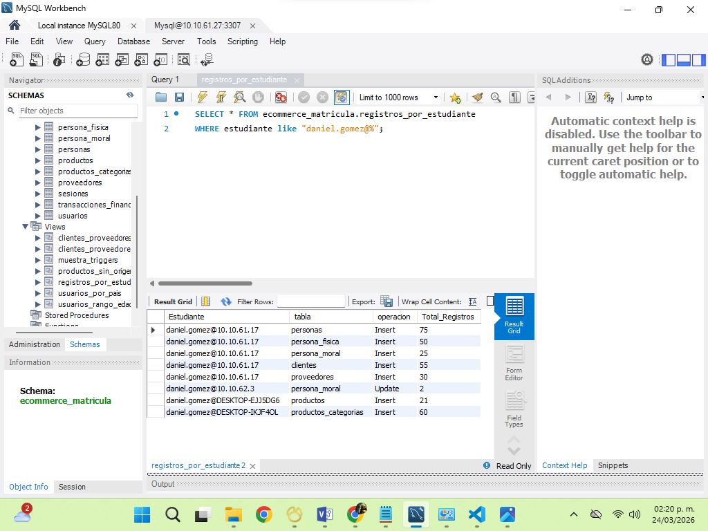
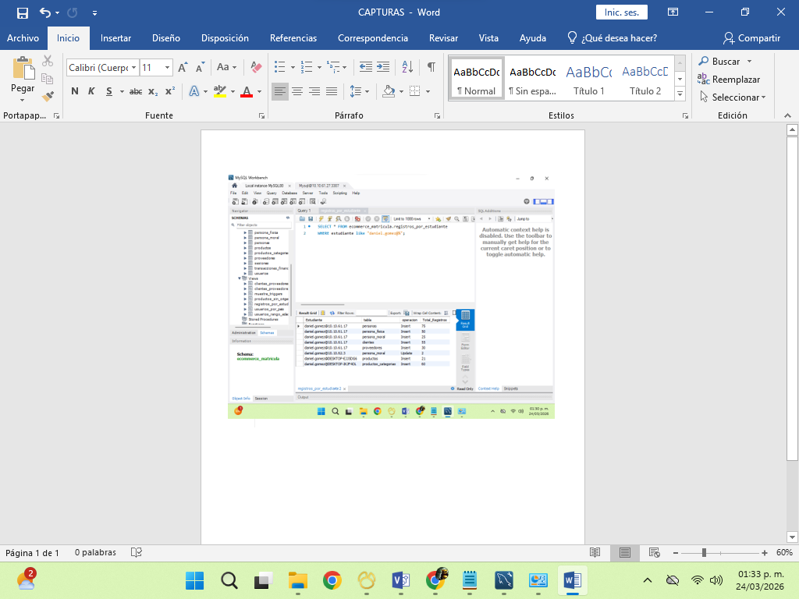

## Test 01: Consultar los registros por estudiantes

### Descripción:
Consulta SQL a la base de datos centralizada del proyecto de clase de e_commerce para la materia de Base de datos para Negocios Digitales

#### Objetivo:
Verificar que el estudiante:
-Comprende la estructura de la base de datos.
-Es capaz de realizar una consulta SELECT correctamente.
-Aplica filtros (*WHERE*) a la vista de **Registros** por estudiante.

## Criterios Evaluación

-Muestra los resultados que ha realizado a ala base de datos
-Deberá contar con 75 registros de personas
-Deberá contar con 50 registros de personas físicas
-Deberá contar con 25 registros de personas morales
-Deberá contar con 20 registros en Productos
-Deberá contar con al menos 40 registros de Categorización de productos (por aquello se les toco una subcategoria)
-Deberá contar con 20 registros de categorización en base al origen del producto (Nacional/Importación)

### Evidencia

#### Estatus:
Exitosa
